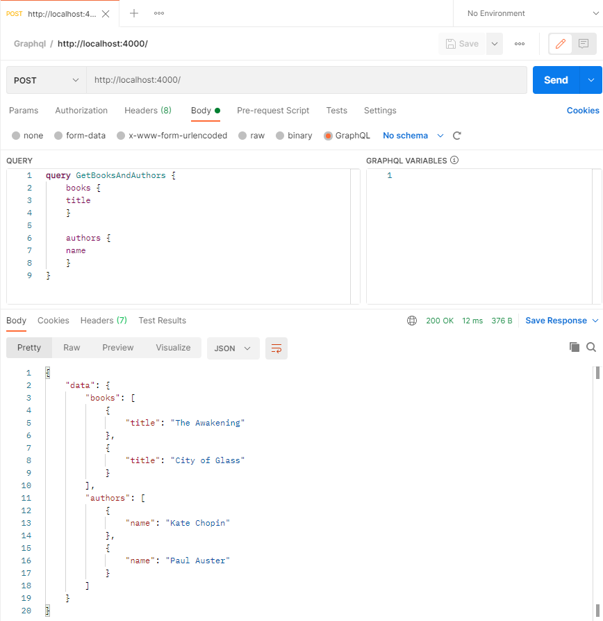

# Apollo Graphql Schema basics

Baseado no exemplo anterior eu tentei me aproximar do repo abaixo:

- https://github.com/Umoren/graphql-auth.git

## queries

    query GetBooksAndAuthors {
      books {
        title
      }

      authors {
        name
      }
    }

    query GetBooks {
      books {
        title
        author {
          name
        }
      }
    }

## Postman

